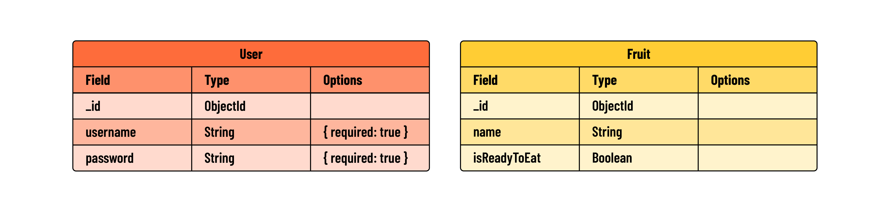
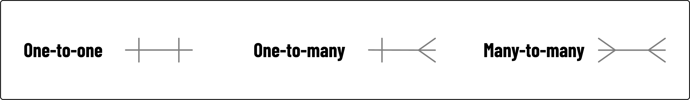
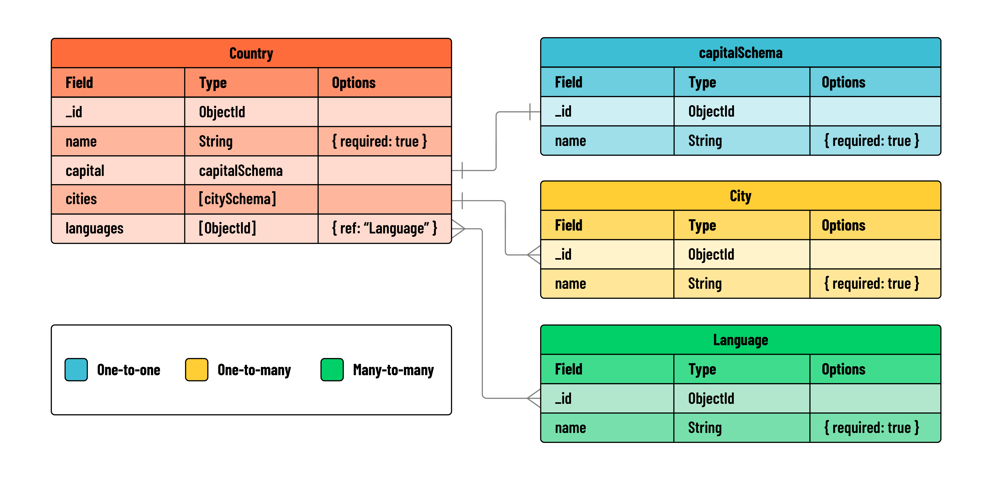

<h1>
  Mongoose Relationships
  Concepts
</h1>

**Learning objective:** By the end of this lesson, students will understand how entities can be related in a MongoDB database.

## MongoDB Relationships

In MongoDB data is represented through documents and collections. These documents are akin to real-world entities, such as `User`, `Post`, `Comment`, or `Purchase`. Each of these entities, or data models, is defined by a unique set of attributes (fields) and can interact or relate to one another in various ways.

A key aspect of MongoDB and its schema design is deciding how to structure these relationships. MongoDB, being schema-less at its core, offers flexibility in how you can link related data.

> In MongoDB, a data entity represents a document in a MongoDB database, and corresponds with the shape of a schema.

## Types of Data Relationships

There are three main types of relationships you will encounter when working with databases:

1. One-to-one (1:1)
Example: A User has a Profile, and a Profile belongs to a User

1. One-to-many (1:n)
Example: A User has many purchases, a Purchase belongs to a User

1. Many-to-many (m:n)
Example: A person has visited many places; places have been visited by many people.

> 🧠 Cardinality refers to the number of elements in one dataset that can relate to the number of elements in another dataset. In the above examples, "to-one" vs. "to-many" are the two possible cardinalities.

## Relationships in MongoDB

There are two approaches to modeling related data in MongoDB:

1. Using **embedding**, where parent documents hold sub-documents.

2. Using **referencing**, where a document contains just the related document’s `ObjectId`.

Both approaches can be used simultaneously in the same document.

## Modeling relationships with ERDs

An ERD (entity relationship diagram) is a flowchart that visually illustrates the relationship between data entities in a system.

When diagramming a MongoDB database, data entities are the collections of documents. In other words, we need to account for all of the models and schemas that we will be working with.

When creating an ERD, we first need to identify the data entities that are involved. We would draw them as rectangles, and label them as nouns - for example: `User`, `Fruit`, etc.

The next step is to determine how the entities are related. Then draw lines between associated fields to show a relationship.

For example, if `reviewSchema` is an embedded schema on a `Post` model, we would draw a line between the `reviews` field of our Post model and the `_id` field on our Review model. As expected, not all entities will be related.

Finally, we need to indicate the type of relationship that these lines represent. In other words, we need to show their cardinality. There are multiple ways to demonstrate this, the simplest is to just have `one` be an undecorated line, and `many` have an endpoint that is a tree or a fork.

