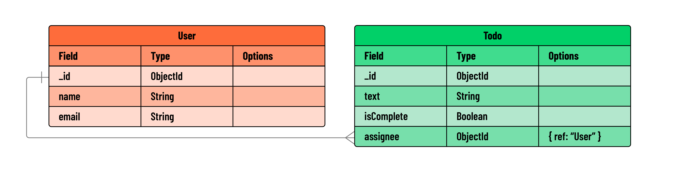

<h1>
  <span class="headline">Mongoose Relationships</span>
  <span class="subhead">Referencing</span>
</h1>

**Learning objective:** By the end of this lesson, students will understand the concept of referencing related data in MongoDB.

## What is referencing?

Referencing is an alternate approach to creating relationships between data entities in MongoDB. It is the practice of creating relationships by storing a **reference** (in the form of an `ObjectId`) to a related document, rather than embedding the related data directly.

Referencing differs from embedding in a few key ways. With embedding, a parent document ***contains the sub-documents***, whereas with referencing a document ***only contains the related document’s `ObjectId`***. Whenever a document needs to access information on the document that it references, it can utilize the referenced `ObjectId` to locate the appropriate document in a separate collection.



> 💡 Both embedding and referencing can be used simultaneously in the same document.

## Deciding which document should hold the reference

When using Mongoose to reference data in MongoDB, you can store the reference (`ObjectId`) in either of the two related documents or even both. This decision depends upon the design and functionality of your application, and it’s not always clear which is best.

In a typical **one-to-many relationship**, it's common for the **many** side (`Todo`) to hold the reference to the **one** side (`User`). This approach is practical because it's more efficient to store a single reference in many documents, rather than storing countless references in a single document.

However, certain scenarios might call for the opposite approach, where the `User` document holds an array of references to the associated `Todo` documents. For example, if your application frequently retrieves a user along with all their assigned tasks, this inverse referencing could be beneficial. Mongoose is versatile enough to support both approaches.

## Why choose referencing over embedding?

While embedding can be more efficient for read operations, referencing has its advantages.

Referencing may be beneficial if:

- The amount of data stored can exceed the 16MB size limit for a document. Exceeding this size is quite uncommon though - all of Shakespeare’s works combined are smaller than 5 megabytes!
- Multiple parent documents need access to the same child document and that child’s data changes frequently. For example, a document modeling a *bank account* should be referenced because it could be “owned” by more than one individual. Suppose the account data were embedded in two or more parent documents. Can you imagine how difficult it would be to keep the transactional & balance data in sync?
- Say you wanted to view all *posts* on a landing page, regardless of the user who posted them, it would take more effort to extract the *posts* from each user if they were embedded. However, it would be quick to get *all posts* from their own collection.

## Implementing references

In this section, we'll explore how to implement references between two models: `Todo` and `User`. Our goal is to establish a `one-to-many (1:M)` relationship where a single `User` can be associated with multiple `Todo` items.

In this updated `todoSchema`, we've added an `assignee` field. This field is structured to hold an ObjectId, which is a unique identifier for MongoDB documents. The `ref` attribute indicates that this ObjectId references documents from the `User` model.

This property will store a reference to the `User` model:

```javascript
// models/todo.js

const mongoose = require('mongoose');

// Embedded data schema
const subtaskSchema = new mongoose.Schema({
  text: String,
  isComplete: Boolean
})

const todoSchema = new mongoose.Schema({
  text: String,
  isComplete: Boolean,
  // subtasks: [subtaskSchema]

  // Add a new field to reference a User:
  assignee: { 
    type: mongoose.Schema.Types.ObjectId, 
    ref: 'User' // Reference to the User model
  }
});

const Todo = mongoose.model('Todo', todoSchema);

module.exports = Todo;
```

> 💡 Note: we previously worked with embedded subtasks in the `Todo` model. For this particular lesson on referencing, we won't be needing these subtasks. Feel free to comment out the subtask-related code. This will help keep our focus on referencing without deleting the work you've already done on embedding.

Next, let's create a new file to store our `User` model:

```bash
touch models/user.js
```

In `models/user.js`, we'll define the `userSchema`, compile it into a model, and export it:

```javascript
// models/user.js

const mongoose = require('mongoose');

// Define the User schema
const userSchema = new mongoose.Schema({
  name: String,
  email: String,
});

const User = mongoose.model('User', userSchema);
module.exports = User;
```

In this scenario, each `todo` document can reference one `user` through the `assignee` field. This field stores the `ObjectId` of the `user` document being referenced. Conversely, a single `user` can be referenced by multiple `todo` documents, which establishes our **one-to-many (1:M) relationship**.

In an application, this would mean one user can have multiple tasks assigned to them. Whenever a `todo` document requires information on the associated `user`, its `ObjectId` reference can be used to locate the appropriate document.
